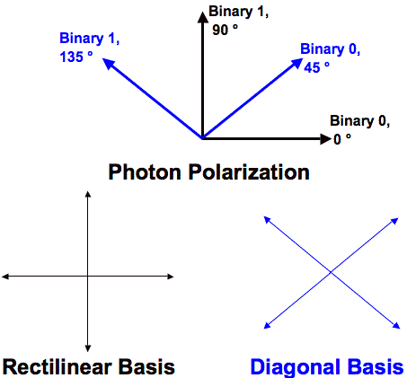

# BB84-Protokoll

## Die Heisenberg'sche Unschärferelation (HUP)
* Ein physikalisches System wird mit Hilfe von Wellenfunktionen beschrieben
* Dabei existieren Eigenschaften, die zueinander komplementär sind:
	* Zwei messbare Grössen $A$ und $B$ sind zueinander komplementär, wenn gilt: $\delta_A \delta_B \geq \frac{\hbar}{2}$
	* Die Varianz der beiden Grössen wird also nie Null, wenn beide Grössen gemessen 	werden. Es ist daher unmöglich beide Eigenschaften genau zu bestimmen

## BB84-Protokoll
* Benannt nach Charles Bennet und Gilles Brassard, 1984 veröffentlicht
* Die Sicherheit von BB84 basiert auf der Heisenberg'sche Unschärferelation
* Dabei werden die Polarisierung von Photonen als Informationsquellen benutzt, deren Eigenschaft der heisenber'sche Unschärferelation unterliegen
* Durch die Übertragung von Photonen über ein optisches Medium wird ein Schlüssel kreiert. Dieser Schlüssel dient dann zur Verschlüsselung einer Nachricht als ein One-Time-Pad
* Es existieren zwei Basen der Polarisation: Gerade und diagonal
	* Die Binärzahl 0 kann entweder mit einem Winkel von 0 Grad (gerade) oder mit 45 Grad (diagonal) polarisiert werden
	* Umgekehrt kann binär 1 mit 90 Grad (gerade) und 135 Grad (ungerade) polarisiert werden

* Die Sicherheit des BB84-Protokolls basiert also nicht auf mathematischen Berechnungen, wie bei kryptologischen Hashfunktionen, sondern auf physikalischen Gesetzesmässigkeiten. Diese können auch mit erhöhtem Rechenaufwand nicht umgangen werden

## Ablauf: Alice möchte Bob einen Schlüssel senden
1. Alice erzeugt einen zufälligen, genügend langen Bitstring
2. Diesen Bitstring enkodiert Alice, indem sie für jedes Bit eine zufällige Polarisation (gerade oder diagonal) wählt
3. Die polarisierten Photonen schickt Alice mithilfe eines optischen Mediums (in der Regel ein Glasfaserkanal) an Bob
4. Wenn Bob die Photonen erhält, misst er die Polarisierung jedes einzelnen Photons mithilfe einer zufällig gewählten Polarisierung (gerade oder diagonal) und dekodiert so den Bitstring
5. Durchschnittlich sollte Bob zu 50% die richtige Polarisierung wählen und daher das korrekte Bit (0 oder 1) zu 50% rekonstruieren können
6. Bob befragt nun Alice (über einen öffentlichen, unsicheren Kanal) über die Polarisation jedes einzelnen Photons
7. Falls er für ein bestimmtes Photon die falsche Polarisierung gewählt hat, weiss er nun, dass das Bit den jeweiligen anderen Wert haben muss
8. Zum jetzigen Zeitpunkt sollten Alice und Bob denselben, identischen Bitstring besitzen, dieser wird auch *sifted key* genannt
9. Alice und Bob können auch (über einen öffentlichen, unsicheren Kanal) ein Teil des Bitstrings miteinander vergleichen, um sicherzugehen, dass sie nicht abgehört wurden
10. Dieser Teil wird dann verworfen. Der restliche Teil bildet dann den *shared secret key*
11. Falls eine Person (Eve) die Nachricht abhören will, muss sie die Polarisierung der Photonen zwischen Alice und Bob messen. Auch Eve muss daher eine zufällig generierte Abfolge von Basen (gerade und diagonal) verwenden, um die Polarisation zu messen
12. Wenn Eve eine falsche Basis gewählt hat, wird die Polarisierung des jeweiligen Photons aufgrund der heisenberg'sche Unschärferelation zufälligerweise neu gesetzt. Falls Eve alle Photonen zu 50% mit der falschen Basis misst, wird Bob die Bits zu 75% korrekt rekonstruiren können
13. Falls Eve alle Bits gemessen hat, sinkt die Wahrscheinlichkeit, dass Eve unentdeckt bleibt nach $n$ verglichenen Bits auf $\frac{3}{4}^n$ (mithilfe von statistischen Tests kann 